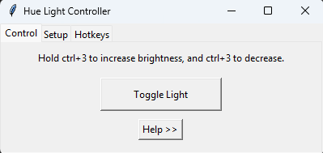

# Philips Hue Controller — Desktop GUI with Hotkeys

A lightweight Python application to control Philips Hue lights using customizable keyboard hotkeys and a simple GUI. Supports brightness adjustments, light toggling, and background operation via system tray.



---

## Features

- Toggle lights with a hotkey
- Increase/decrease brightness by holding hotkeys
- Full GUI (Tkinter) with:
  - Control tab
  - Setup tab (Bridge IP + username)
  - Hotkeys tab (modifier support)
- Hotkeys saved to `hue_settings.json`
- Minimizes to system tray (pystray)
- Packaged as a standalone `.exe` (optional)

---

## Installation & Setup
- Download the philips.py file and all dependencies
- Run the program, a Tkinter GUI window should pop up
- Navigate to the "Setup" tab, and click on "Get Bridge IP"
- Click on the link button on your physical Hue Bridge, then click on "Generate Username" in the setup tab.
- Apply your settings, and it is ready. Set hotkeys to your own desires.

### Requirements

- Python 3.8+
- Philips Hue Bridge & lights
- `pip install -r requirements.txt`

### Dependencies

```bash
pip install requests keyboard pystray pillow
